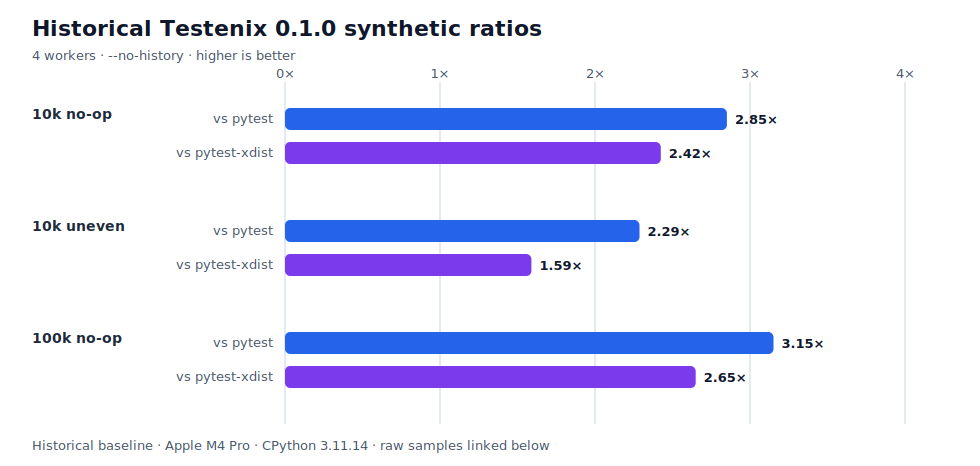

# Published benchmark results

These tables are generated from the raw JSON committed in `benchmarks/`. They are development
evidence for specific synthetic workloads, not a universal claim that Testenix is always faster
than pytest.



## Median wall-clock time

Lower time is better. A speedup of `2.85×` means pytest's median
wall time was 2.85 times the Testenix median for that exact
scenario.

| Scenario | Testenix | pytest | pytest-xdist | vs pytest | vs xdist |
| --- | ---: | ---: | ---: | ---: | ---: |
| 10,000 no-op tests / 16 modules | 0.869 s | 2.477 s | 2.106 s | 2.85× | 2.42× |
| 10,000 uneven-duration tests / 16 modules | 1.345 s | 3.076 s | 2.138 s | 2.29× | 1.59× |
| 100,000 no-op tests / 16 modules | 8.038 s | 25.333 s | 21.300 s | 3.15× | 2.65× |

<div class="benchmark-caveat">
The 100,000-test result meets the project's local five-run, one-warmup minimum.
It remains a synthetic result from one machine, not a universal performance promise.
</div>

## Environment

- CPU: Apple M4 Pro (14 logical CPUs)
- Machine: `arm64`
- Platform: `macOS-26.5.1-arm64-arm-64bit`
- Python: `3.11.14`
- Measurement: complete subprocess wall-clock time, including discovery, execution, aggregation,
  and console rendering
- Correctness gate: every command had to exit successfully and report the expected test count


## Raw samples and variance

### 10,000 no-op tests / 16 modules

- Testenix range: 0.857 s–0.892 s
- Testenix standard deviation: 0.013 s
- Testenix raw samples: 0.869, 0.857, 0.863, 0.892, 0.871 seconds
- pytest range: 2.447 s–2.522 s
- pytest standard deviation: 0.027 s
- pytest raw samples: 2.522, 2.477, 2.471, 2.447, 2.479 seconds
- pytest-xdist range: 2.075 s–2.267 s
- pytest-xdist standard deviation: 0.081 s
- pytest-xdist raw samples: 2.170, 2.267, 2.077, 2.075, 2.106 seconds
- Measured rounds: 5; warmups: 1
- Workers: 4
- Recorded at: `2026-07-20T12:12:43.635798+00:00`
- Commit: `8f24f8a7bd72fa876988a8ce96364be97e35c2b6`
- Clean working tree at capture: yes
- [Raw JSON](https://github.com/polishdataengineer/testenix/blob/main/benchmarks/baseline.json)

### 10,000 uneven-duration tests / 16 modules

- Testenix range: 1.336 s–1.378 s
- Testenix standard deviation: 0.016 s
- Testenix raw samples: 1.336, 1.378, 1.342, 1.345, 1.356 seconds
- pytest range: 3.043 s–3.085 s
- pytest standard deviation: 0.016 s
- pytest raw samples: 3.070, 3.085, 3.043, 3.076, 3.077 seconds
- pytest-xdist range: 2.109 s–2.176 s
- pytest-xdist standard deviation: 0.025 s
- pytest-xdist raw samples: 2.146, 2.129, 2.109, 2.138, 2.176 seconds
- Measured rounds: 5; warmups: 1
- Workers: 4
- Recorded at: `2026-07-20T12:13:53.369799+00:00`
- Commit: `18d9bba6cb5c8e39c2d5b211ee4384ae8f824524`
- Clean working tree at capture: yes
- [Raw JSON](https://github.com/polishdataengineer/testenix/blob/main/benchmarks/baseline_uneven.json)

### 100,000 no-op tests / 16 modules

- Testenix range: 7.912 s–8.096 s
- Testenix standard deviation: 0.075 s
- Testenix raw samples: 7.912, 8.096, 8.086, 8.038, 7.997 seconds
- pytest range: 25.188 s–27.005 s
- pytest standard deviation: 0.772 s
- pytest raw samples: 27.005, 25.333, 25.246, 25.188, 25.380 seconds
- pytest-xdist range: 21.120 s–22.216 s
- pytest-xdist standard deviation: 0.486 s
- pytest-xdist raw samples: 21.239, 21.120, 22.216, 21.300, 21.949 seconds
- Measured rounds: 5; warmups: 1
- Workers: 4
- Recorded at: `2026-07-20T12:19:39.942492+00:00`
- Commit: `24b877c2f98420e91dcd2c8bcbc9417c7cf1ac96`
- Clean working tree at capture: yes
- [Raw JSON](https://github.com/polishdataengineer/testenix/blob/main/benchmarks/baseline_100k.json)

## Interpretation

The checked-in results show that Testenix has low per-test overhead for large generated suites and
that its built-in process model is competitive with both sequential pytest and pytest-xdist in
those scenarios.

They do **not** yet answer how Testenix performs for import-heavy applications, complex fixture
graphs, assertion failures, real repositories, or different operating systems. Pytest also has a
far larger plugin and tooling ecosystem. Read the
[full performance analysis](../performance-analysis.md) for profiling details, memory notes,
implemented optimizations, and the Rust/PyO3 decision.

## Reproduce

Run the same harness from a locked development environment:

```console
$ uv sync --locked --dev --no-editable
$ uv run python benchmarks/run_benchmark.py --tests 10000 --workers 4 --repeats 5
$ uv run python benchmarks/run_benchmark.py --tests 10000 --workers 4 --repeats 5 --uneven
$ uv run python benchmarks/run_benchmark.py --tests 100000 --workers 4 --repeats 5
```

Review the [benchmarking contract](../benchmarking.md) before comparing or publishing new data.
